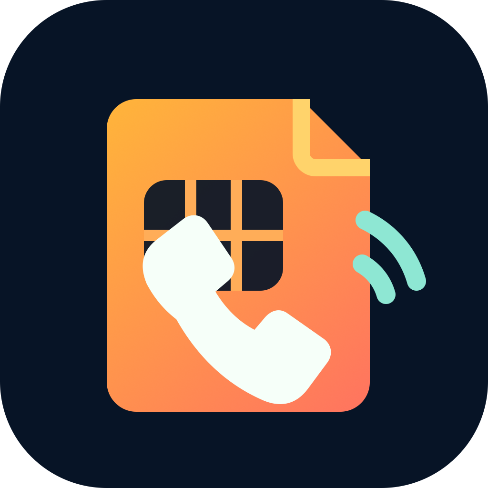
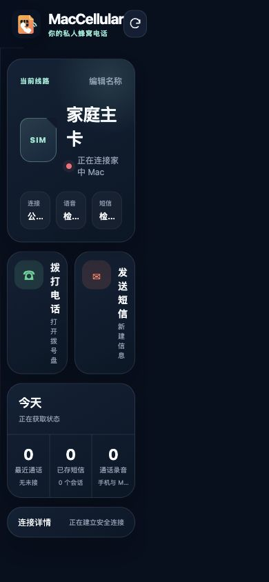
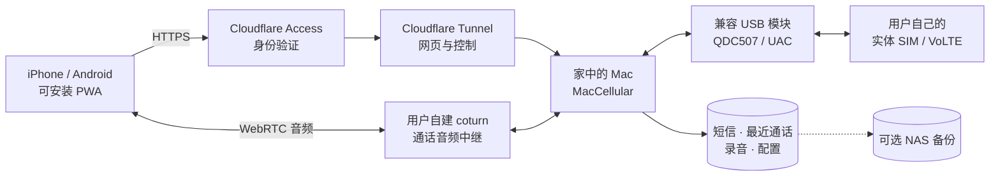
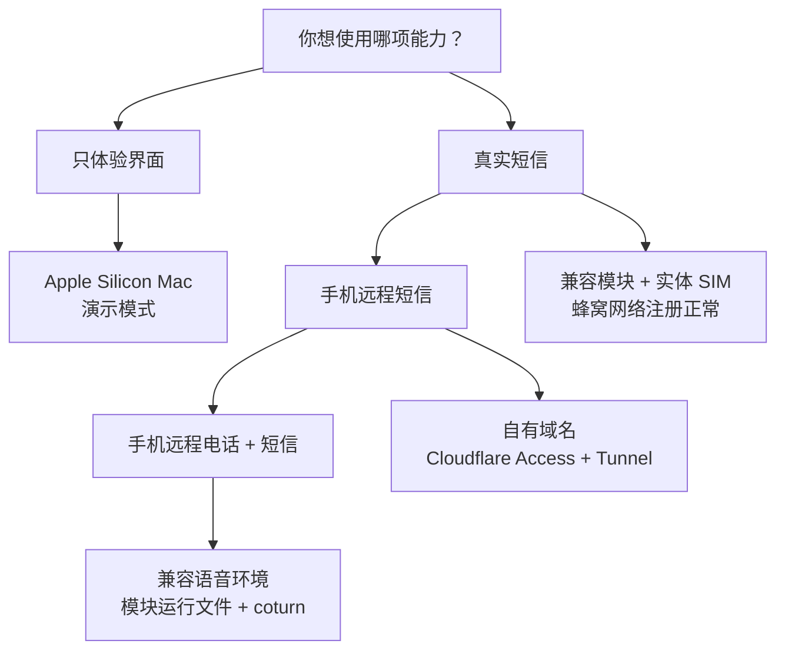

<p align="center">
  
</p>

<h1 align="center">MacCellular</h1>

<p align="center"><strong>把留在家中 Mac 上的实体 SIM，带到你的手机浏览器里。</strong></p>

<p align="center">电话 · 短信 · 来电提醒 · 通话录音 · 本地数据</p>

把插在家中 Mac 上的实体 SIM，变成可在 iPhone、Android 和电脑浏览器中使用的
私人电话与短信服务。

MacCellular 面向希望继续使用实体 SIM、但不想随身携带第二台手机的人。4G 模块负责
接入蜂窝网络，Mac 负责通话、短信、数据保存和远程连接，手机端只需要一个可安装到
主屏幕的网页应用。

> 当前版本：`1.0.0-rc.4`，公开预发布候选；尚不是 `v1.0.0` 正式版。

> **这不是插上模块即可使用的消费电子产品。** 仓库和 DMG 提供 Mac 后端、网页、
> 安装器及配置工具，但不附带 SIM、USB 蜂窝模块、Apple 开发者签名、域名、
> Cloudflare 账户、Tunnel、TURN 服务器或模块侧语音运行文件。短信和电话所需条件
> 不同，请先阅读下面的“部署前必须准备”。

<p align="center">
  
</p>

## 它解决什么问题

- 实体 SIM 可以长期留在家中，出门仍能接打电话和收发短信；
- 手机不需要与模块处于同一局域网，也不需要长期连接 Tailscale；
- 家庭网络不开放入站端口，Mac 主动连接 Cloudflare Tunnel；
- 通话录音、短信和最近通话保留在自己的 Mac 上，可继续归档到 NAS；
- 1.0 明确限定为个人单线路使用，不提供卡池、批量插卡或批量话务能力。

## 当前能力

| 能力 | 状态 |
| --- | --- |
| 网页拨号、接听、挂断 | 已在 QDC507 + Apple Silicon Mac 上实测 |
| 双向语音 | 已通过家庭 Wi-Fi 与 iPhone 蜂窝网络实测 |
| 通话中 DTMF | 可用，适合 10086 等语音菜单 |
| 来电提醒 | 前台提示与 Web Push 均已接入 |
| 短信 | 增量同步、会话视图、发送、刷新和本机持久保存 |
| 最近通话 | 呼入、呼出、未接记录，可直接回拨 |
| 通话录音 | 手机端播放，同时同步一份到 Mac |
| 远程访问 | Cloudflare Access + Tunnel；Tailscale 仅作管理后备 |
| 线路范围 | 1.0 只支持单模块、单实体 SIM 的个人自托管场景 |
| 原生 iOS/Android App | 不属于 1.0；当前产品是可安装 PWA |

接通后的双向语音、延迟和音质已经达到日常可用水平。当前 1.0 收尾重点是首次安装、
连续拨号稳定性、弱网恢复和来电接通时间。

## 支持范围

### 已验证组合

- Apple Silicon Mac，macOS 13 或更高版本；
- QDC507 / Baiwang 类 4G 模块，模块 USB 身份为 `2ca3:4006`；
- QDC507GLEFM21、Linux `3.18.44` 的已验证语音运行环境；
- iPhone Safari/PWA 与 Android Chrome；
- Cloudflare Tunnel、Cloudflare Access 和独立 coturn 服务。

### 需要单独验证的组合

- Intel Mac、Windows；
- 不同 QDC507 固件、其他运营商定制模块；
- 不具备同一 UAC/ADB/内核环境的 4G 模块；
- 多模块、卡池、批量呼叫或向第三方提供通信服务。

同样的 VID/PID 不代表音频路径一定相同。首次接入新硬件时，应先运行检查，不要直接
修改模块配置。

## 产品结构



**图例：** 实线表示产品运行所需链路；虚线表示可选归档。Cloudflare、TURN、域名、
模块和 SIM 都由部署者自行提供，仓库不托管这些服务。

公网只进入独立的用户功能端口。USB、AT、调试接口和本机管理接口不会通过公网入口
发布。家庭 Mac 只需要主动向外建立连接。

## 快速开始

### 部署前必须准备

| 目标 | 用户需要自行准备 |
| --- | --- |
| 只在 Mac 看演示界面 | Apple Silicon Mac；不需要模块或公网服务，但不能收发真实通信 |
| 使用真实短信 | 兼容 USB 蜂窝模块、本人合法控制且可正常注册的实体 SIM、常驻 Mac |
| 从手机远程使用短信 | 上述条件，以及自己的域名、Cloudflare 账户、Access 应用、Named Tunnel 和允许登录的邮箱 |
| 从手机接打电话 | 上述全部条件，以及已验证的 QDC507 语音环境、模块侧运行文件、独立 coturn 服务、可公网访问的 TURN 域名和相应端口 |
| 后台来电提醒 | 电话链路可用，并允许 PWA 通知；iPhone 需要添加到主屏幕 |

项目不会替用户创建或托管 Cloudflare/TURN，不提供公共中继服务器，也不保证未验证
模块、固件、SIM 套餐或运营商支持 VoLTE/UAC。当前 macOS App 使用临时签名，首次
打开需要按安装说明确认；尚未提供 Apple 公证或 App Store/TestFlight 分发。

如果只需要本地短信，可以不部署 TURN；如果需要公网电话，不能跳过 TURN 和模块语音
环境。完整准备清单和各项参数来源见
[安装与首次配置](docs/GETTING_STARTED.md)。



1. 在 Mac 上连接受支持的 4G 模块并确认 SIM 已注册 VoLTE；
2. 从本仓库 [Releases](../../releases) 下载当前 RC 的 macOS arm64 DMG；
3. 双击“安装 MacCellular.command”；
4. 需要手机访问时，双击“配置手机访问.command”，选择“短信”或“电话与短信”；
5. 按向导填入自己的 Cloudflare Access、Tunnel 和 TURN 信息；
6. 在手机 Safari/Chrome 打开自己的域名，并选择“添加到主屏幕”。

当前公开的是 Release Candidate，不是 `v1.0.0` 正式版。源码用户先阅读
[安装与首次配置](docs/GETTING_STARTED.md)。仓库只提供示例域名和参数，维护者实际
使用的域名、服务器、账户和部署配置不属于公开项目。

### 本地构建

```sh
git clone <本页面显示的仓库 URL>
cd maccellular
./scripts/build-macos.sh
```

构建结果写入 `dist/`。要安装公网网页服务，先运行不会更改系统的检查：

```sh
./deploy/public-web-mac/install-local.sh check --help
```

只有检查通过后，才把同一组参数改为 `apply`。完整示例和升级、回滚、迁移说明见
[macOS 网页服务安装](deploy/public-web-mac/README.md)。

## 数据在哪里

默认运行目录：

```text
~/Library/Application Support/MacCellular/
  bin/                  程序文件
  config/               本机配置
  data/sms-store/       短信
  data/call-history.json
  data/call-recordings/ 通话录音
  data/push/            来电提醒订阅
  logs/                 运行日志
```

少量源码目录和内部二进制标识仍保留历史名称，以便持续追踪来源；全新 1.0 安装的
应用、LaunchAgent 和运行数据均使用 **MacCellular** 名称。迁移到另一台 Mac 时，应停止服务后复制 `config/`
和 `data/`，再由新版本安装器恢复服务；不要只复制可执行文件。

## 仓库导航

| 路径 | 内容 |
| --- | --- |
| `cmd/djonehub-macos` | Mac 后端、网页 API 与内嵌 PWA |
| `macos/DJOneHubNotifier` | macOS 音频、通知和模块 UAC helper |
| `internal/remotevoice` | WebRTC/PCMU 媒体会话 |
| `deploy/public-web-mac` | 家庭 Mac 安装、升级、回滚和迁移 |
| `deploy/public-turn` | coturn 配置与验收工具 |
| `internal/sipgateway`, `internal/sipwebrtc` | 可选的外置 SIP 兼容路径 |
| `docs` | 架构、硬件验证、历史决策与发行说明 |

更完整的目录说明见 [源码结构](docs/SOURCE_STRUCTURE.md)。

## 自主实现与参考边界

MacCellular 的产品架构、移动网页、Cloudflare Access 接入、WebRTC/TURN 远程媒体、
电话状态机、短信与录音存储、Web Push、macOS 安装迁移和运维工具，均在本仓库中
围绕真实产品需求独立设计和实现。

项目早期的 USB/AT、eSIM 和模块管理基础可以追溯到 VoHive/DJOneHub；UAC 探测和
QDC507 音频路径参考了 MaVo、Celldock 等公开项目及同类实现提供的技术线索。参考
意味着验证接口和工程路径，不意味着复制它们的产品结构。原作者版权、许可证和
修改边界保留在 [第三方声明](THIRD_PARTY_NOTICES.md) 中。

仓库不内置或再分发模块侧内核模块和 ARM helper。手机访问向导会在用户确认后从
原始 MaVo 项目的固定源码版本直接准备本机缓存；这些文件不会进入 MacCellular 的源码或安装包。

## 版本与发布状态

- 产品版本采用独立的 `1.x` 版本线，不再沿用历史 DJOneHub 的发布编号；
- 当前公开 `1.0.0-rc.4` 测试候选；`v1.0.0` 正式版需完成剩余真机验收后另行发布；
- 面向用户的版本摘要见 [MacCellular 1.0 发行说明](docs/RELEASE_NOTES_1.0.md)；
- [1.0 发布检查表](docs/RELEASE_CHECKLIST.md) 全部通过后，才可正式发布；
- 面向用户的变化保留在 [更新记录](CHANGELOG.md)；私人研发记录、旧部署判断和真实
  运行证据不进入公开仓库。

## 参与开发

生成仅保存在本机、不含旧 Git 历史的公开源码候选：

```bash
./scripts/stage-public-source.sh
```

该命令只写入 `local/public-release/`，不会发布、打 tag 或修改当前仓库。

提交问题前请先阅读 [支持说明](SUPPORT.md)。代码贡献流程见
[CONTRIBUTING.md](CONTRIBUTING.md)。这个仓库欢迎兼容硬件报告、可复现日志、界面
改进和文档修正，但请勿提交 SIM 标识、电话号码、短信、录音、密钥或 Tunnel token。

## 合法与负责任使用

MacCellular 不是运营商、GOIP 卡池、呼叫中心或号码转换服务。1.0 不提供改号、伪造
主叫、批量插卡、批量拨号、群发短信、验证码代收或第三方话务转售。使用者必须合法
控制 SIM、号码、模块和账户，并遵守所在地法律、运营商合同和录音/个人信息规则。

本项目不能替代紧急电话，也不保证适用于任何公开运营、商业部署或多线路场景。完整
边界、禁止用途和中国大陆相关法规入口见
[合法与负责任使用边界](LEGAL_AND_RESPONSIBLE_USE.md)。免责声明不能使违法用途合法。
默认数据流、第三方服务和卸载保留策略见 [数据与隐私说明](PRIVACY.md)。

## 许可证

本仓库按根目录 [LICENSE](LICENSE) 提供源码，当前为 PolyForm Noncommercial 1.0.0，
并保留 VoHive required notice。它是 source-available 的非商业项目，不应误称为
OSI 批准的开源许可证。第三方组件继续适用各自许可证，详见
[THIRD_PARTY_NOTICES.md](THIRD_PARTY_NOTICES.md)。为什么 1.0 不直接改成 AGPL，见
[许可证说明](docs/LICENSING.md)。
