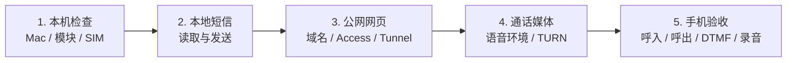
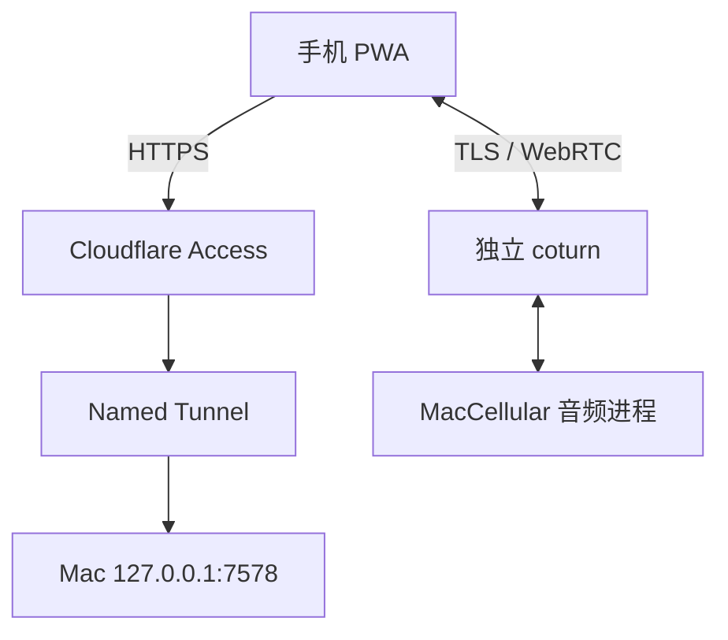

# 安装与首次配置

本文面向第一次下载 MacCellular 的用户。普通使用不需要阅读硬件实验、Asterisk 或
public-edge 文档。

## 先选择使用方式

| 模式 | 用途 | 需要的外部服务 |
| --- | --- | --- |
| 本机演示 | 看界面，不连接模块 | 无 |
| 短信 | 远程查看和发送短信 | Cloudflare Access + Tunnel |
| 电话与短信 | 完整 PWA、来电提醒和语音 | 上述服务 + coturn + 兼容语音运行环境 |

1.0 默认支持 Apple Silicon Mac 和一个兼容模块。Windows、Intel Mac、多模块、卡池、
批量话务或向第三方提供通信服务不属于支持范围。

## 先准备好这些东西

MacCellular 不是购买硬件后的即插即用服务，也不附送任何公网账户。根据使用方式，
用户需要自行准备：

- 一台可常驻运行的 Apple Silicon Mac；
- 一个兼容 USB 蜂窝模块，以及本人合法控制、已实名并可正常注册网络的实体 SIM；
- 短信远程访问所需的自有域名、Cloudflare 账户、Access self-hosted application、
  Named Tunnel、访问策略和允许登录邮箱；
- 电话功能所需的兼容 QDC507 固件/语音环境、模块侧运行文件、独立 coturn 服务、
  TURN 域名、证书和公网可达端口；
- iPhone/Android 浏览器权限，以及来电提醒所需的 PWA 主屏幕安装和通知权限。

仓库不会提供公共 Cloudflare Tunnel、TURN 中继、域名、SIM、运营商套餐或模块运行
文件，也不会替用户完成 DNS、Access、VPS 防火墙和路由器配置。示例中的
`phone.example.com`、`turn.example.com` 和邮箱均为占位符，必须替换为用户自己的
配置。

最低可用路径建议从“Mac 本机识别模块和短信”开始，再配置公网短信，最后增加 TURN
与电话。演示界面能打开不代表模块、运营商、音频或公网链路已经可用。

## 推荐安装顺序



每一步通过后再进入下一步。若前一步失败，后续页面能够打开也不能证明完整链路可用。

## 安装发行版

普通用户使用 DMG，不需要安装 Go、Swift、libusb，也不需要手工编辑 LaunchAgent：

1. 双击“安装 MacCellular.command”；
2. 打开 MacCellular App，确认模块、SIM 和短信状态；
3. 双击“配置手机访问.command”；
4. 选择“短信”或“电话与短信”，按提示填写自己的公网配置；
5. 向导先检查，确认后才安装并启动服务。

向导不会把 Tunnel token、TURN secret 或通知私钥放进命令参数。电话模式的通知私钥由向导在本机自动生成。

当前 Release Candidate 使用临时签名，尚未经过 Apple Developer ID 公证。如果 macOS
首次阻止安装脚本，请在 Finder 中右键“安装 MacCellular.command”并选择“打开”。这不是
要求用户关闭 Gatekeeper，也不需要运行解除隔离或修改系统安全设置的命令。正式发布页
必须继续明确标注签名状态；取得 Developer ID 后再提供公证版本。

## 从源码构建

需要 Go、Xcode Command Line Tools、Swift 和本机可用的 libusb：

```sh
./scripts/build-macos.sh
./macos/DJOneHubNotifier/build-app.sh
```

后端产物位于 `dist/djonehub-macos-arm64`，音频 helper 位于
`macos/DJOneHubNotifier/.build-output/DJOneHubNotifier`。

只查看界面可以运行：

```sh
./dist/djonehub-macos-arm64 -demo -listen 127.0.0.1:7576
```

然后打开 `http://127.0.0.1:7576/`。演示模式不会操作模块，也不能证明硬件兼容。

## 连接模块

1. 插入模块，等待 macOS 完成 USB 枚举；
2. 保持 SIM 无 PIN 锁并已开通 VoLTE；
3. 不要手工指定系统中其他 `/dev/cu.*` 串口；QDC507 在 macOS 上通过 libusb
   vendor-specific interface 工作；
4. 先运行安装器 `check`。检查不通过时不要直接改 USB profile。

已验证的直连语音路径还需要兼容的模块侧运行环境。DMG 的手机访问向导会在用户确认后直接从 [MaVo 的固定源码版本](https://github.com/moluncn/mavo/tree/0443dfdaf8aec086fd76ba2ee9152fd908114524/Resources/ModuleVoice) 下载到：

```text
~/Library/Application Support/MacCellular Runtime/ModuleVoice/
```

其中的模块侧文件不随本仓库分发。也可单独执行：

```sh
./scripts/prepare-module-voice.sh check
./scripts/prepare-module-voice.sh install
```

`install` 只写入 Mac 本机缓存，不把文件复制进源码或发行包。模块真正使用这些文件前，后端还会验证它们是否与已支持的运行环境一致。

## 配置手机公网入口

需要用户自己的域名，例如：

```text
phone.example.com   Cloudflare Access + Tunnel
turn.example.com    DNS 直连 coturn
```

Cloudflare 中需要：

1. 创建一个 Access self-hosted application；
2. 创建 Named Tunnel，将电话域名转到 Mac 的 `http://127.0.0.1:7578`；
3. 记录 team domain、Access AUD、允许登录的邮箱和 Tunnel token；
4. TURN 域名单独指向 coturn，不经过普通 HTTP Tunnel。

TURN 的准备说明见 [`deploy/public-turn/README.md`](../deploy/public-turn/README.md)。



**端点说明：** 电话网页域名走 Access 与 Tunnel；TURN 域名直接指向 coturn，不能把
TURN 音频流量当作普通 HTTP 请求转进 Cloudflare Tunnel。

## 安装家庭 Mac 服务

安装器默认是检查模式，不修改现网。短信模式示例：

```sh
./deploy/public-web-mac/install-local.sh check \
  --profile sms \
  --public-host phone.example.com \
  --team-domain YOUR_TEAM.cloudflareaccess.com \
  --aud YOUR_ACCESS_AUD \
  --email you@example.com \
  --binary "$PWD/dist/djonehub-macos-arm64" \
  --cloudflared /opt/homebrew/bin/cloudflared \
  --token-file /absolute/private/path/tunnel-token
```

电话与短信还需要 helper 和 TURN shared secret；面向普通用户的向导会自动选择包内 helper 并生成通知私钥。开发者使用的完整参数见
[`deploy/public-web-mac/README.md`](../deploy/public-web-mac/README.md)。

检查通过后，将同一条命令中的 `check` 改为 `apply`。安装器会安装并启动后台服务；
失败时恢复原版本。不要用手工复制 plist 的方式绕过安装器。

## 手机端

1. Safari 或 Chrome 打开自己的电话域名；
2. 完成 Cloudflare Access 登录；
3. iPhone 选择“分享 → 添加到主屏幕”；
4. 首次通话时允许网页使用麦克风；
5. 在设置卡片中开启来电提醒。

## 升级和迁移

升级时用新 binary 重跑同一安装器。迁移到另一台 Mac 时：

1. 在旧 Mac 停止三个 LaunchAgent；
2. 复制 `~/Library/Application Support/MacCellular/config` 和 `data`；
3. 在新 Mac 上用新 binary 运行安装器；
4. 检查短信、通话记录、录音和 Push 状态后再停用旧 Mac。

不要把旧 Mac 与新 Mac 同时连接同一模块或同时运行同一个 Tunnel token。

## 出问题时先看哪里

```text
~/Library/Application Support/MacCellular/logs/djonehub-public-web.log
~/Library/Application Support/MacCellular/logs/djonehub-media-helper.log
~/Library/Application Support/MacCellular/logs/cloudflared.log
```

提交问题时提供：Mac 型号、macOS 版本、模块型号/固件、故障时间、操作步骤和删去
电话号码后的相关日志。不要上传短信、录音或任何凭据。
